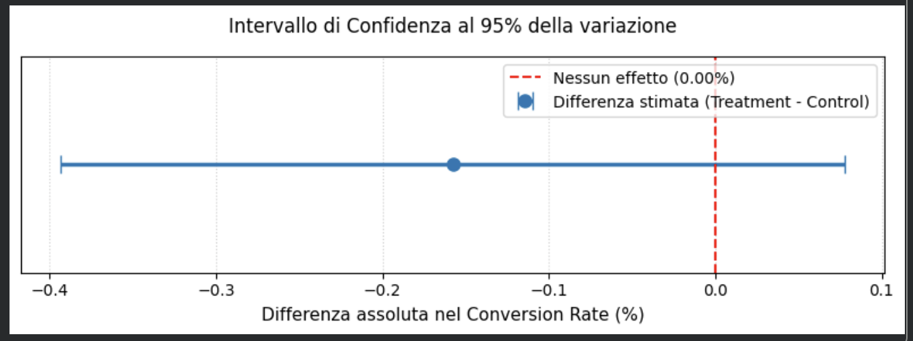

# 📊 E-Commerce Landing Page A/B Testing & Statistical Inference

## 📌 Executive Summary
Questo progetto documenta l'intero ciclo analitico di un esperimento controllato (A/B Test) condotto su un campione di **290.584 utenti unici** di una piattaforma e-commerce per valutare il rollout di una nuova landing page rispetto a quella storica.

A valle di un rigoroso protocollo metodologico (dimensionamento preventivo, data hygiene, verifica SRM e test Z a due proporzioni), l'analisi ha evidenziato che la nuova variante produce una variazione statisticamente non significativa con lift puntuale negativo (**-0.16%**, $p = 0.1899$). 

**Raccomandazione finale:** **DON'T SHIP (Rollback)** per asimmetria sfavorevole del profilo di rischio economico.

---

## 🛠️ Stack Tecnologico
* **Linguaggio & Librerie:** Python (`pandas`, `numpy`, `scipy`, `statsmodels`, `matplotlib`)
* **Metodologia:** Statistical Power Analysis, Chi-Square Goodness-of-Fit (SRM), Two-Proportion Z-Test, 95% Confidence Intervals

---

## 🔬 Metodologia Sperimentale

### 1. Pre-Test Sizing & Power Analysis
Prima dell'ispezione dei dati, sono stati definiti i requisiti di potenza statistica per evitare falsi positivi (Tipo I) e sottopotenza (Tipo II):
* **Baseline Conversion Rate:** $12.00\%$
* **Minimum Detectable Effect (MDE):** $+1.00\%$ (variazione minima economicamente rilevante)
* **Significatività ($\alpha$):** $0.05$
* **Potenza Statistica ($1 - \beta$):** $0.80$
* **Campione minimo richiesto:** $17.164$ utenti per variante ($34.328$ totali).

### 2. Data Cleaning & Sample Ratio Mismatch (SRM)
* **Log iniziali:** 294.478 record.
* **Anomalia rilevata:** Rilevata disallocazione tecnica (1.928 utenti `control` esposti a `new_page` e 1.965 utenti `treatment` esposti a `old_page`).
* **Bonifica:** Rimozione delle sessioni disallineate e deduplica per utente (`drop_duplicates` su `user_id`).
* **SRM Test:** Test del Chi-quadro sullo split teorico 50/50:
  $$\chi^2 = 0.0045, \quad p\text{-value} = 0.9468$$
  *Nessuna evidenza di Sample Ratio Mismatch: randomizzazione valida.*

---

## 📈 Risultati Statistici

| Metrica | Gruppo Control (A) | Gruppo Treatment (B) | Delta / Test Stat |
| :--- | :---: | :---: | :---: |
| **Utenti Esposti** | 145.274 | 145.310 | +36 utenti |
| **Conversioni** | 17.489 | 17.264 | -225 conversioni |
| **Conversion Rate (CR)** | **12.04%** | **11.88%** | **-0.16%** (Lift relativo: -1.31%) |
| **Z-Score** | - | - | **-1.3109** |
| **p-value** | - | - | **0.1899** |
| **95% Conf. Interval** | - | - | **[-0.39%, +0.08%]** |

---

## 💡 Decisione Finale & Impatto di Business

### Verdetto: DON'T SHIP
1. **Mancanza di significatività:** Con $p = 0.19 > 0.05$, non vi è sufficiente evidenza per rigettare $H_0$.
2. **Profilo di rischio asimmetrico:** L'intervallo di confidenza al 95% include lo zero e si estende prevalentemente in territorio negativo (fino a -0.39% di CR). Il rilascio esporrebbe il business a un potenziale calo di fatturato a fronte di un upside massimo stimato ad appena +0.08%.
3. **Next Steps:** Mantenere in linea la versione originale (`old_page`) e condurre un'analisi di funnel on-page (scroll depth, drop-off e heatmap) con il team UX per identificare le criticità della nuova variante.
